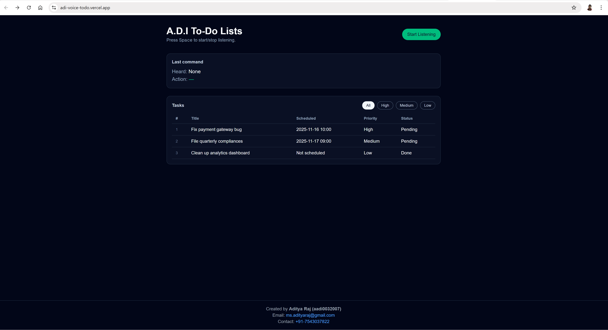

# 🎙️ A.D.I Voice To-Do App — AI Powered Task Manager

## 🚀 Landing Page UI

A voice-controlled smart to-do list where you can **speak naturally**, and the AI will automatically **create**, **update**, **delete**, or **filter** your tasks.

Press **Space** or click the button to speak — and watch your tasks update instantly.

---
# 📘 About the Project

The **A.D.I Voice To-Do App** is a lightweight, real-time, AI-powered productivity assistant designed to make task management as natural as having a conversation.  
Instead of typing, clicking, or navigating menus, you simply **speak**, and the app interprets your intent using advanced language understanding.

---

## ⚠️ Session-Based (Important)

This is a **session-based prototype**:

- Tasks exist only during your active browsing session  
- If you **refresh**, the 3 default tasks reappear  
- No database (yet) — everything is in-memory for speed

This design keeps the assistant **super fast and low latency**.

---

# 🚀 Features

### 🎤 **Voice-controlled commands**
Examples:
- “Create a task to fix bugs tomorrow.”
- “Delete task 2.”
- “Change task number 3 priority to high.”
- “Mark task one as done.”
- “Schedule a task for Monday at 6 PM.”
The AI extracts intent, target task, priority, status, and time — all in real time.

### 🤖 **AI-powered intent parsing**
Spoken commands → structured JSON intent → applied to your task list.

### ⚡ **Low latency**
- Browser speech recognition (0ms server delay)
- Small, fast LLM (`gpt-4o-mini`)
- No database → instant updates

### 📊 **Smart UI**
- Tasks sorted by priority + schedule  
- Priority filters (All / High / Medium / Low)  
- Live “last heard” and “last action” indicators  

---

# 🧠 AI & LLM Details

### **Model Used:**  
`gpt-4o-mini` (OpenAI)

### **Why this model?**
| Factor | Reason |
|--------|--------|
| ⚡ Speed | Sub-second latency, ideal for real-time voice |
| 🎯 Accuracy | Excellent at structured JSON extraction |
| 💰 Cost | Very cheap to run |
| 🔍 Precision | Handles command parsing extremely well |
| 🧩 Right-sized | Heavy LLMs add lag & don’t improve intent parsing |

We intentionally avoid large models (e.g., GPT-4, GPT-5 class) to:
- reduce latency  
- increase command responsiveness  
- keep cost near zero  

Result: **Fast, accurate, and efficient voice commands.**

---

# 🏗️ Tech Stack

## Frontend (Vercel)
- **Next.js 14 (App Router)**
- **React 18**
- **Tailwind CSS**
- **Web Speech API** for voice input
- **Deployed on Vercel**

## Backend (Render)
- **FastAPI**
- **Python 3**
- **OpenAI API**
- CORS Enabled
- `/parse-intent` REST endpoint
- **Deployed on Render**

---

# 🔧 How It Works (Architecture)
You Speak → Browser SpeechRecognition
- transcript normalized
- sent to FastAPI backend
- OpenAI LLM parses intent (JSON)
- Frontend updates tasks instantly

---

# 🧪 Usage Instructions

### 1️⃣ Start Listening  
Press **Space**  
—or—  
Click **Start Listening**

### 2️⃣ Speak Commands Like
- “Create a low priority task to finish the report tomorrow morning.”
- “Update task 2 to high priority.”
- “Delete task number 3.”
- “Show only high priority tasks.”

### 3️⃣ Enjoy Instant Results  
AI interprets your command and updates the task list immediately.

---

# 📦 Roadmap (Upcoming Features)
- Persistent database (Supabase or Firebase)
- Login + user accounts
- Whisper Web for perfect speech recognition
- Real-time collaboration
- Mobile app version

---

# 👤 Author

**Aditya Raj (aadi0032007)**  
📧 Email: **ms.adityaraj@gmail.com**  
📞 Contact: **+91 7543037822**

---

